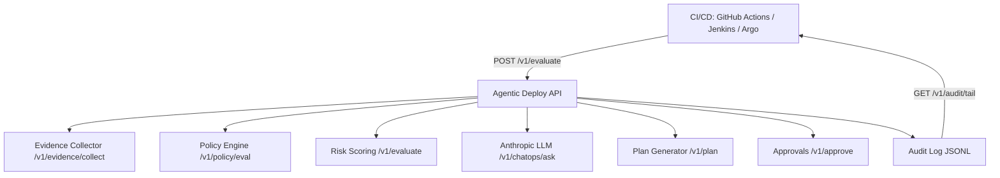

# Agentic Deploy

**Anthropic-powered** agentic AI gate for deployment pipelines across **dev / qa / prod**.
It converts a deploy into a **traceable decision**: evidence → policy → risk → rollout plan → approvals → audit.

> This repo uses **Anthropic** as the LLM provider everywhere the agent needs reasoning.
> If `ANTHROPIC_API_KEY` is not set, it runs in a deterministic **Anthropic mock mode** (still the same Anthropic flow).

## Architecture



**Impact across environments**
- **dev**: fast feedback, lenient posture, mostly auto-approve
- **qa**: balanced posture, canary defaults, catches regressions early
- **prod**: strict posture, policy requirements, high-risk → human approval

## Quickstart

```bash
docker compose up --build
curl http://localhost:8080/health
```

### Configure Anthropic
Create `.env`:
```bash
ANTHROPIC_API_KEY=YOUR_KEY
ANTHROPIC_MODEL=claude-3-5-sonnet-latest
```
Then:
```bash
docker compose --env-file .env up --build
```

## Endpoints (12 total)

Below are **examples for every endpoint** with:
- request
- response
- what it means (how it helps dev/qa/prod)

---
### 1) GET /health
```bash
curl http://localhost:8080/health
```
**Response**
```json
{"ok":true}
```
**Meaning**: service is alive.

---
### 2) GET /version
```bash
curl http://localhost:8080/version
```
**Response**
```json
{"name":"agentic-deploy-anthropic","version":"0.2.0","mode":"anthropic"}
```
**Meaning**: confirms runtime mode is Anthropic (or rules_only).

---
### 3) GET /v1/envs/{env}/status
```bash
curl http://localhost:8080/v1/envs/prod/status
```
**Response**
```json
{
  "env":"prod",
  "posture":"strict",
  "gate_open":true,
  "notes":["prod posture=strict","prod uses stricter policies (probes/limits) and higher risk sensitivity"]
}
```
**Meaning**: shows environment posture (dev/qa/prod behavior).

---
### 4) POST /v1/evidence/collect
```bash
curl -X POST http://localhost:8080/v1/evidence/collect \
  -H "Content-Type: application/json" \
  -d '{
    "service":"payments-api",
    "env":"qa",
    "change_id":"sha-abc123",
    "sources":["git","metrics","incidents"]
  }'
```
**Response**
```json
{
  "evidence":{"service":"payments-api","env":"qa","change_id":"sha-abc123","sources":["git","metrics","incidents"],"...":"..."},
  "audit_id":"audit_xxxxxxxxxxxxxxxxxx",
  "meaning":"Collected deploy evidence for the agent to reason on."
}
```
**Meaning**: standardizes deploy evidence (reduces blind deploys).

---
### 5) POST /v1/metrics/ingest
```bash
curl -X POST http://localhost:8080/v1/metrics/ingest \
  -H "Content-Type: application/json" \
  -d '{
    "env":"dev",
    "service":"payments-api",
    "error_rate":0.002,
    "p95_ms":180,
    "cpu_pct":41,
    "mem_pct":62
  }'
```
**Response**
```json
{"ok":true,"audit_id":"audit_...","meaning":"Captured a metrics snapshot used for risk scoring."}
```
**Meaning**: brings SLO/telemetry into the deploy decision (dev/qa/prod).

---
### 6) POST /v1/policy/eval
```bash
curl -X POST http://localhost:8080/v1/policy/eval \
  -H "Content-Type: application/json" \
  -d '{
    "env":"prod",
    "rules":[],
    "manifests":[{"kind":"Deployment","spec":{"template":{"spec":{"containers":[{"name":"app"}]}}}}]
  }'
```
**Response**
```json
{"allowed":false,"deny_reasons":["prod_requires_readinessProbe","prod_requires_resource_limits"],"audit_id":"audit_...","meaning":"Policy guardrails for the target environment."}
```
**Meaning**: prevents unsafe prod deploys by requiring baseline hygiene.

---
### 7) POST /v1/evaluate
```bash
curl -X POST http://localhost:8080/v1/evaluate \
  -H "Content-Type: application/json" \
  -d '{
    "service":"payments-api",
    "env":"prod",
    "change_id":"sha-abc123",
    "diff_summary":"+ add env var FEATURE_X; + HPA maxReplicas 20",
    "manifests":[{"kind":"Deployment","name":"payments-api","namespace":"prod"}],
    "metrics_snapshot":{"error_rate":0.003,"p95_ms":180},
    "strategy_preference":"canary"
  }'
```
**Response**
```json
{
  "decision":"approve_with_canary",
  "risk":{"score":42,"level":"medium","reasons":["prod_target","scaling_change","strict_env_posture"]},
  "policy":{"allowed":true,"deny_reasons":[]},
  "plan":{"type":"canary","steps":["10% 5m","25% 10m","50% 15m","100%"],"rollback":"auto_on_slo_breach"},
  "audit_id":"audit_...",
  "meaning":"Single source of truth: risk + policy + rollout plan for dev/qa/prod."
}
```
**Meaning**: turns deploy into an auditable, environment-aware decision.

---
### 8) POST /v1/plan
Same request shape as `/v1/evaluate`, returns plan only.
```bash
curl -X POST http://localhost:8080/v1/plan \
  -H "Content-Type: application/json" \
  -d '{
    "service":"payments-api",
    "env":"qa",
    "change_id":"sha-abc123",
    "diff_summary":"+ minor config change",
    "manifests":[{"kind":"Deployment","name":"payments-api","namespace":"qa"}],
    "metrics_snapshot":{"error_rate":0.001,"p95_ms":120},
    "strategy_preference":"blue_green"
  }'
```
**Response**
```json
{"plan":{"type":"blue_green","steps":["deploy_green","smoke_test","switch_traffic"],"rollback":"switch_back"},"audit_id":"audit_...","meaning":"Returns a rollout plan (canary/blue-green/rolling) matched to risk."}
```
**Meaning**: standardized rollout planning per env.

---
### 9) POST /v1/approve
Used when `/v1/evaluate` returns `requires_approval`.
```bash
curl -X POST http://localhost:8080/v1/approve \
  -H "Content-Type: application/json" \
  -d '{"audit_id":"audit_...","approver":"oncall_sre","decision":"approve"}'
```
**Response**
```json
{"ok":true,"audit_id":"audit_...","meaning":"Records a human approval/denial for high-risk changes."}
```
**Meaning**: controlled prod change management without slowing dev.

---
### 10) GET /v1/decisions/{audit_id}
```bash
curl http://localhost:8080/v1/decisions/audit_...
```
**Response**
```json
{"audit_id":"audit_...","approval":{"approver":"oncall_sre","decision":"approve"},"meaning":"Fetches the human gate decision used to proceed/rollback."}
```
**Meaning**: pipeline can poll this to proceed.

---
### 11) GET /v1/audit/tail
```bash
curl http://localhost:8080/v1/audit/tail | jq .
```
**Response**
```json
{"events":[{"audit_id":"audit_...","type":"evaluate","ts":...}], "meaning":"Last 100 audit events (evidence, policy, evaluate, approvals)."}
```
**Meaning**: observable governance trail for dev/qa/prod.

---
### 12) POST /v1/chatops/ask  (Anthropic)
```bash
curl -X POST http://localhost:8080/v1/chatops/ask \
  -H "Content-Type: application/json" \
  -d '{
    "env":"prod",
    "question":"Should we proceed with this deploy? What checks should run?",
    "context":{"decision":"approve_with_canary","risk_score":42,"policy_allowed":true}
  }'
```
**Response**
```json
{
  "result":{
    "note":"anthropic_mock_mode_no_api_key",
    "answer":"(string)",
    "actions":["(optional list of recommended next actions)"],
    "confidence":0.7
  },
  "audit_id":"audit_...",
  "meaning":"Anthropic-assisted guidance for deploy decisions and next steps."
}
```
**Meaning**: teams get human-readable reasoning + next actions, while keeping the pipeline deterministic.

## Deploy in Kubernetes (Helm)

```bash
helm install agentic-deploy ./helm/agentic-deploy \
  --set image.repository=YOUR_IMAGE \
  --set image.tag=latest
```

Create secret:
```bash
kubectl create secret generic agentic-deploy-secrets \
  --from-literal=ANTHROPIC_API_KEY="YOUR_KEY"
```

## Notes
- Replace the built-in policy engine with **OPA/Conftest** when ready.
- Replace in-memory approvals with Slack/Jira/DB.
- Wire real evidence sources (GitHub API, Prometheus, Argo Rollouts, incident tools).

